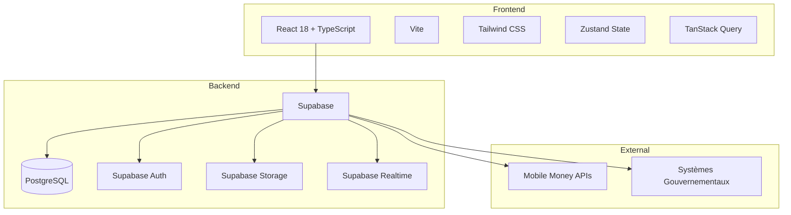

# eLoyer Kinshasa

**Plateforme gouvernementale de gestion locative et mobilisation des recettes fiscales**

> *Chaque logement enregistré, chaque loyer tracé, chaque paiement sécurisé, chaque recette mobilisée.*

## Vue d'ensemble

eLoyer Kinshasa est la plateforme digitale de la Ville de Kinshasa (RDC) pour digitaliser l'écosystème locatif : enregistrement des bailleurs, gestion des biens, contrats de location, paiements Mobile Money, calcul automatique des impôts et intelligence des recettes fiscales.

## Architecture



## Stack technique

| Couche | Technologies |
|--------|-------------|
| Frontend | Vite, React 18, TypeScript (strict), Tailwind CSS |
| UI | Radix UI, HeadlessUI, Lucide React, CVA |
| State | Zustand, TanStack Query |
| Forms | React Hook Form, Zod |
| Backend | Supabase (PostgreSQL, Auth, Storage, Realtime) |
| Maps/Charts | Leaflet, Recharts |

## Scorecard performance

Lighthouse 12, build de production (`npm run build && npm run preview`).
Mobile = profil par défaut (Moto G Power, 3G lente 1,6 Mb/s / 150 ms, CPU ×4) ;
desktop = `--preset=desktop`. **Médiane de 5 exécutions** pour la landing, de 3
pour les autres pages.

| Page | Profil | Perf | A11y | Best Practices | SEO | FCP | LCP | TBT | CLS |
|------|--------|:----:|:----:|:--------------:|:---:|----:|----:|----:|----:|
| `/` (landing) | mobile | **99** ⁽¹⁾ | 100 | 100 | 100 | 0,63 s | 1,28 s | 107 ms | 0 |
| `/` (landing) | desktop | **100** | 100 | 100 | 100 | 0,17 s | 0,38 s | 0 ms | 0 |
| `/login` | mobile | **100** | 100 | 100 | 100 | 0,63 s | 0,76 s | 7 ms | 0 |
| `/login` | desktop | **100** | 100 | 100 | 100 | 0,17 s | 0,54 s | 0 ms | 0,001 |
| `/register` | mobile | **100** | 100 | 100 | 100 | 0,64 s | 0,76 s | 9 ms | 0 |
| `/register` | desktop | **100** | 100 | 100 | 100 | 0,17 s | 0,56 s | 0 ms | 0,002 |
| `/verify` | mobile | **100** | 100 | 100 | 66 ⁽²⁾ | 0,63 s | 0,76 s | 10 ms | 0 |
| `/forgot-password` | mobile | **100** | 100 | 100 | 66 ⁽²⁾ | 0,63 s | 0,76 s | 3 ms | 0 |
| `/reset-password` | mobile | **100** | 100 | 100 | 66 ⁽²⁾ | 0,63 s | 0,75 s | 6 ms | 0,003 |

⁽¹⁾ Exécutions : 99 · 99 · 97 · 100 · 99 — la seule variance est le TBT (84–202 ms) ;
FCP, LCP et CLS sont stables à ±0,01 s. Sur toutes les pages, l'élément LCP est le
**shell statique** d'`index.html` (photo héro sur `/`, titre `h1.as-title` sur les pages auth).
⁽²⁾ Volontaire : les flux à jeton (`/verify`, `/forgot-password`, `/reset-password`)
portent `noindex` ; seuls `/`, `/login` et `/register` sont indexables.

Comment ces scores sont obtenus et comment les préserver : [docs/PERFORMANCE.md](docs/PERFORMANCE.md).
Recette sur téléphone Android réel : [docs/DEVICE_TESTING.md](docs/DEVICE_TESTING.md).

## Prérequis

- Node.js 20+
- npm 10+
- Compte Supabase configuré

## Installation

```bash
# Cloner le repository
git clone <repo-url>
cd eloyer-kinshasa

# Installer les dépendances
npm install

# Configurer l'environnement
cp .env.example .env
# Éditer .env avec vos clés Supabase

# Appliquer les migrations Supabase
supabase db reset

# Démarrer le serveur de développement
npm run dev
```

## Variables d'environnement

| Variable | Description |
|----------|-------------|
| `VITE_SUPABASE_URL` | URL du projet Supabase |
| `VITE_SUPABASE_ANON_KEY` | Clé publique (anon) Supabase |
| `VITE_APP_NAME` | Nom de l'application |
| `VITE_APP_ENV` | Environnement (development/staging/production) |
| `VITE_API_BASE_URL` | URL de l'API REST Supabase |
| `VITE_MOBILE_MONEY_PROVIDERS` | Fournisseurs Mobile Money (séparés par virgule) |

## Structure du projet

```
src/
├── api/              # Couche API (Axios + endpoints)
├── components/       # Composants UI réutilisables
│   ├── auth/         # Protection des routes
│   ├── common/       # Composants partagés
│   ├── layouts/      # Layouts (Auth, Dashboard)
│   ├── navigation/   # Sidebar, TopBar, BottomNav
│   └── ui/           # Design system
├── config/           # Configuration app, routes, Supabase
├── contexts/         # React contexts (Auth)
├── hooks/            # Custom hooks
├── lib/              # Utilitaires
├── pages/            # Pages de l'application
├── services/         # Services métier
├── stores/           # Zustand stores
├── styles/           # CSS global et thème
└── types/            # Types TypeScript

supabase/
├── migrations/       # Migrations SQL
└── seed/             # Données de seed

tests/
└── e2e/              # Suite Playwright (auth-flow.spec.ts) + mock Supabase en mémoire
```

## Workflow de développement

1. Créer une branche feature : `git checkout -b feature/ma-fonctionnalite`
2. Développer avec `npm run dev`
3. Vérifier le build : `npm run build`
4. Linter : `npm run lint`
5. Tests :
   - `npm run test` — tests unitaires (vitest) : machine à états des paiements, mapping des erreurs, politique de retry, estimation fiscale
   - `npm run check:edge` et `npm run test:edge` — type-check et tests Deno des Edge Functions (signature HMAC, parsing webhooks, moteur fiscal)
   - `npm run test:e2e` — parcours Playwright, mobile et desktop, sur un Supabase simulé en mémoire (sans identifiants ; `npx playwright install chromium` au premier lancement) :
     - authentification : landing → inscription → OTP → tableau de bord → déconnexion → connexion
     - paiement avec calcul d'impôt, tableau de bord fiscal du bailleur, simulateur fiscal
6. Commit et PR

## Déploiement

```bash
# Build de production
npm run build

# Preview local
npm run preview
```

Déployer le dossier `dist/` sur Vercel, Netlify ou infrastructure gouvernementale.

## Documentation

- [Architecture](docs/ARCHITECTURE.md)
- [Base de données](docs/DATABASE.md)
- [Flux d'authentification](docs/AUTH_FLOW.md)
- [Architecture des paiements](docs/PAYMENT_ARCHITECTURE.md)
- [Intégration Mobile Money](docs/MOBILE_MONEY_INTEGRATION.md)
- [Webhooks de paiement](docs/PAYMENT_WEBHOOKS.md)
- [Moteur fiscal](docs/TAX_ENGINE.md)
- [Référentiel des règles fiscales](docs/TAX_RULES_REFERENCE.md)
- [Performance — static shell, paint-first loader, polices](docs/PERFORMANCE.md)
- [Recette sur appareil Android réel](docs/DEVICE_TESTING.md)
- [Guide de contribution](docs/CONTRIBUTING.md)

## Licence

© 2025 Ville de Kinshasa — République Démocratique du Congo
