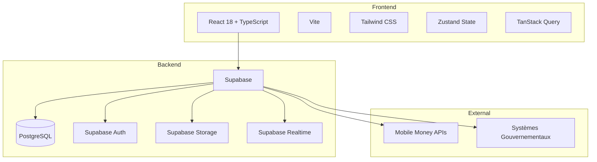

# eLoyer Kinshasa

**Plateforme gouvernementale de gestion locative et mobilisation des recettes fiscales**

> *Chaque logement enregistré, chaque loyer tracé, chaque paiement sécurisé, chaque recette mobilisée.*

## Vue d'ensemble

eLoyer Kinshasa est la plateforme digitale de la Ville de Kinshasa (RDC) pour digitaliser l'écosystème locatif : enregistrement des bailleurs, gestion des biens, contrats de location, paiements Mobile Money, calcul automatique des impôts et intelligence des recettes fiscales.

## Architecture



## Stack technique

| Couche | Technologies |
|--------|-------------|
| Frontend | Vite, React 18, TypeScript (strict), Tailwind CSS |
| UI | Radix UI, HeadlessUI, Lucide React, CVA |
| State | Zustand, TanStack Query |
| Forms | React Hook Form, Zod |
| Backend | Supabase (PostgreSQL, Auth, Storage, Realtime) |
| Maps/Charts | Leaflet, Recharts |

## Prérequis

- Node.js 20+
- npm 10+
- Compte Supabase configuré

## Installation

```bash
# Cloner le repository
git clone <repo-url>
cd eloyer-kinshasa

# Installer les dépendances
npm install

# Configurer l'environnement
cp .env.example .env
# Éditer .env avec vos clés Supabase

# Appliquer les migrations Supabase
supabase db reset

# Démarrer le serveur de développement
npm run dev
```

## Variables d'environnement

| Variable | Description |
|----------|-------------|
| `VITE_SUPABASE_URL` | URL du projet Supabase |
| `VITE_SUPABASE_ANON_KEY` | Clé publique (anon) Supabase |
| `VITE_APP_NAME` | Nom de l'application |
| `VITE_APP_ENV` | Environnement (development/staging/production) |
| `VITE_API_BASE_URL` | URL de l'API REST Supabase |
| `VITE_MOBILE_MONEY_PROVIDERS` | Fournisseurs Mobile Money (séparés par virgule) |

## Structure du projet

```
src/
├── api/              # Couche API (Axios + endpoints)
├── components/       # Composants UI réutilisables
│   ├── auth/         # Protection des routes
│   ├── common/       # Composants partagés
│   ├── layouts/      # Layouts (Auth, Dashboard)
│   ├── navigation/   # Sidebar, TopBar, BottomNav
│   └── ui/           # Design system
├── config/           # Configuration app, routes, Supabase
├── contexts/         # React contexts (Auth)
├── hooks/            # Custom hooks
├── lib/              # Utilitaires
├── pages/            # Pages de l'application
├── services/         # Services métier
├── stores/           # Zustand stores
├── styles/           # CSS global et thème
└── types/            # Types TypeScript

supabase/
├── migrations/       # Migrations SQL
└── seed/             # Données de seed
```

## Workflow de développement

1. Créer une branche feature : `git checkout -b feature/ma-fonctionnalite`
2. Développer avec `npm run dev`
3. Vérifier le build : `npm run build`
4. Linter : `npm run lint`
5. Commit et PR

## Déploiement

```bash
# Build de production
npm run build

# Preview local
npm run preview
```

Déployer le dossier `dist/` sur Vercel, Netlify ou infrastructure gouvernementale.

## Documentation

- [Architecture](docs/ARCHITECTURE.md)
- [Base de données](docs/DATABASE.md)
- [Flux d'authentification](docs/AUTH_FLOW.md)
- [Guide de contribution](docs/CONTRIBUTING.md)

## Licence

© 2025 Ville de Kinshasa — République Démocratique du Congo
