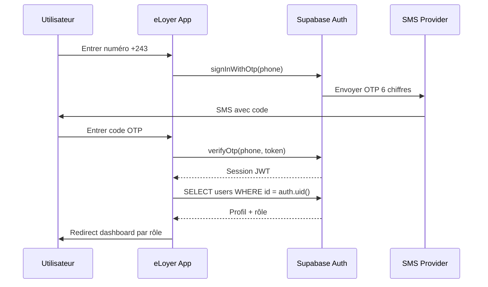

# Flux d'authentification

## Phone OTP (principal)



## Inscription multi-étapes

1. **Type de compte** — Bailleur / Locataire / Agence
2. **Téléphone** — Envoi OTP + vérification
3. **Informations** — Nom, email, commune, adresse
4. **KYC** — Documents (requis bailleur, optionnel locataire)
5. **Création profil** — Insert `users` + `bailleurs` si applicable

## Gestion de session

- Auto-refresh token activé (`autoRefreshToken: true`)
- Session persistée en localStorage
- Intercepteur Axios rafraîchit le token sur 401
- `onAuthStateChange` synchronise le store Zustand

## Protection des routes

```typescript
// Route protégée avec rôles
<ProtectedRoute allowedRoles={['bailleur', 'gestionnaire']} />

// Garde composant
<RoleGuard roles="admin" fallback={<AccessDenied />}>
  <AdminPanel />
</RoleGuard>
```

## Redirection post-login

| Rôle | Destination |
|------|-------------|
| bailleur | `/bailleur/tableau-de-bord` |
| locataire | `/locataire/accueil` |
| admin | `/admin/tableau-de-bord` |
| agent_fiscal | `/fiscal/tableau-de-bord` |

## Sécurité

- OTP expire après 5 minutes
- Délai de renvoi : 60 secondes
- Rôles en base de données, jamais en JWT user_metadata
- Audit log sur connexion/déconnexion
