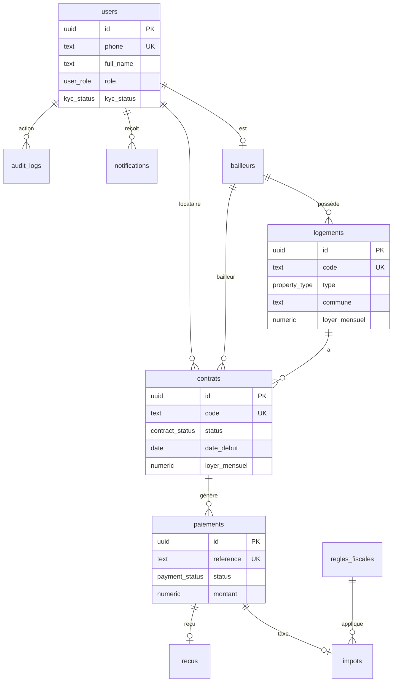

# Schéma de base de données

## Diagramme entité-relation



## Tables principales

### users
Profil utilisateur lié à `auth.users`. Source de vérité pour le rôle.

### bailleurs
Extension profil pour propriétaires avec score de conformité fiscal.

### logements
Biens immobiliers avec code unique auto-généré : `KIN-GOM-AV123-PARC456-APP012`

### contrats
Contrats de location liant bailleur, locataire et logement.

### paiements
Transactions de loyer via Mobile Money ou autres moyens.

### impots
Taxes calculées automatiquement via `calculate_tax_for_payment()`.

### recus
Reçus de paiement avec code unique `REC-KIN-YYYY-XXXXXX`.

### regles_fiscales
Règles fiscales configurables par commune, type de bien, montant.

### audit_logs
Journal d'audit pour conformité gouvernementale.

## Enums

| Enum | Valeurs |
|------|---------|
| user_role | bailleur, locataire, agence, admin, agent_fiscal, gestionnaire |
| property_type | Appartement, Studio, Villa, Bureau, Magasin, Entrepôt |
| payment_status | en_attente, en_cours, complete, echoue, rembourse |
| contract_status | brouillon, actif, suspendu, resilie, expire |
| tax_status | calcule, declare, paye, en_retard, exonere |

## Migrations

```bash
# Appliquer les migrations
supabase migration up

# Seed des communes et règles fiscales
psql -f supabase/seed/01_communes.sql
psql -f supabase/seed/02_tax_rules.sql
```

## Index principaux

- `logements(code)` — recherche par code propriété
- `contrats(bailleur_id, status)` — contrats actifs par bailleur
- `paiements(contrat_id, periode)` — paiements par période
- `notifications(user_id, read)` — notifications non lues
