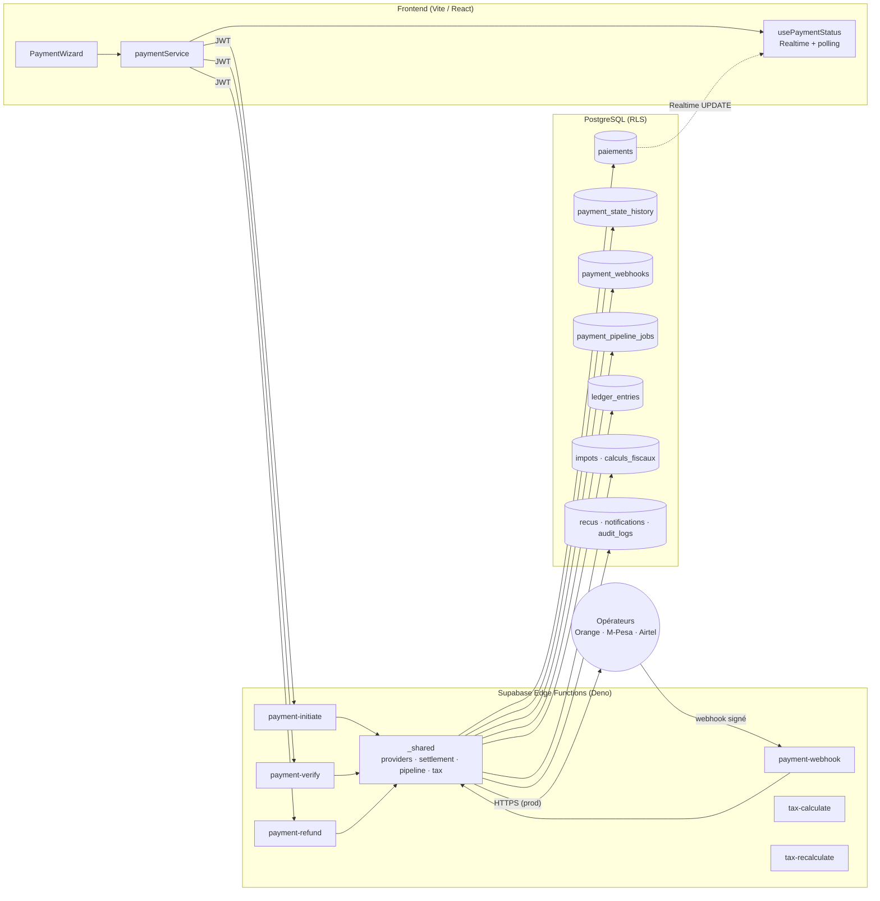
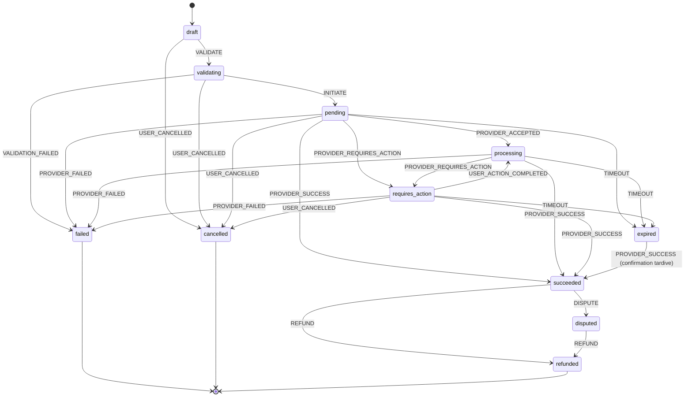
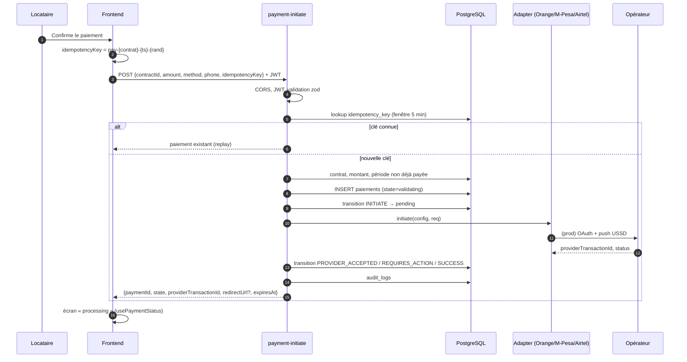
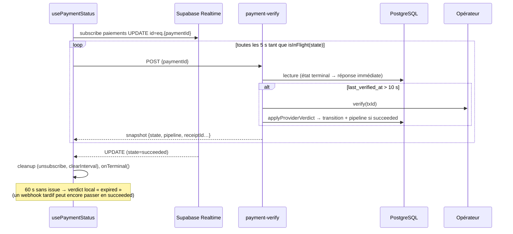
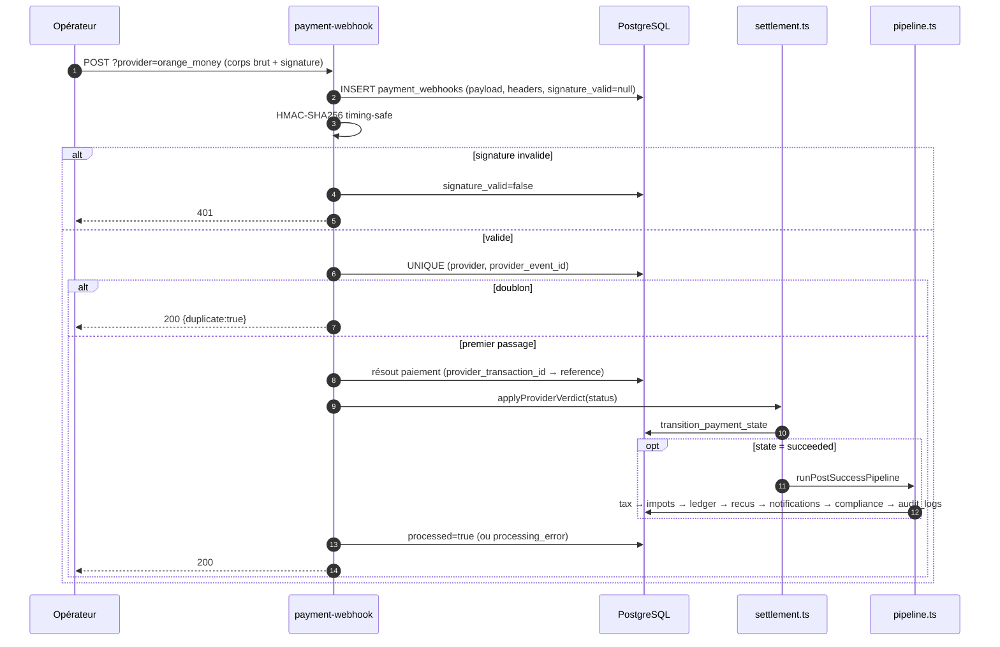
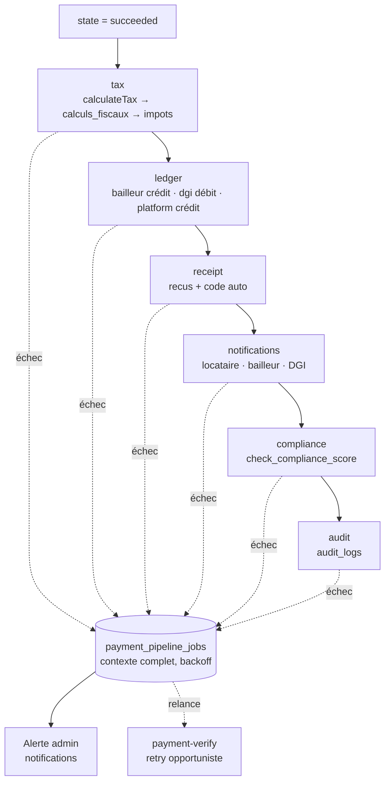

# Architecture des paiements — Module 4

> Infrastructure de paiement de niveau gouvernemental : zéro confiance entre le
> frontend et les opérateurs, machine à états stricte, idempotence de bout en
> bout, piste d'audit complète.

Documents liés : [MOBILE_MONEY_INTEGRATION.md](./MOBILE_MONEY_INTEGRATION.md) ·
[PAYMENT_WEBHOOKS.md](./PAYMENT_WEBHOOKS.md) · [TAX_ENGINE.md](./TAX_ENGINE.md)

---

## 1. Principes

| Principe | Mise en œuvre |
|---|---|
| **Zéro confiance frontend ↔ opérateur** | Le navigateur ne connaît aucune clé opérateur. Il appelle uniquement des Edge Functions authentifiées par JWT (`payment-initiate`, `payment-verify`, `payment-refund`) ou des RPC protégées par RLS (`cancel_own_payment`). |
| **Le webhook fait autorité** | Les changements d'état « argent reçu » proviennent de l'opérateur (webhook) ou d'une vérification serveur → serveur (`payment-verify`). Le frontend ne peut jamais écrire `succeeded`. |
| **Machine à états unique** | `src/services/payment/stateMachine.ts` est la source de vérité, mirrorée octet pour octet dans `supabase/functions/_shared/stateMachine.ts` (`npm run sync:edge`, test unitaire de dérive). La transition SQL `transition_payment_state()` refuse toute transition illégale. |
| **Idempotence** | Clé client sur `payment-initiate` (fenêtre 5 min), `(provider, provider_event_id)` unique sur les webhooks, clés dérivées sur chaque étape du pipeline. |
| **Audit** | `payment_state_history` (chaque transition + raison), `payment_webhooks` (payload brut, même invalide), `audit_logs`, `calculs_fiscaux`, `ledger_entries`. |
| **Sandbox / production** | `PAYMENT_MODE=sandbox` (défaut) → simulateur déterministe, aucun appel réseau. `production` → appels réels (`// TODO: Enable in production`). |

---

## 2. Vue d'ensemble



---

## 3. Machine à états



### Choix de conception

- `PROVIDER_SUCCESS` est accepté depuis `pending`, `processing` **et** `requires_action` : les webhooks peuvent arriver dans le désordre.
- `expired → succeeded` est légal : si l'opérateur confirme après le délai local de 60 s, l'argent a bel et bien bougé.
- Les états d'argent reçu (`succeeded`) ne peuvent aller que vers `refunded` / `disputed`.
- `failed`, `cancelled`, `refunded` sont finaux (`isFinal`). `isTerminal` inclut aussi `succeeded`, `expired`, `disputed`.

### API (`stateMachine.ts`)

| Fonction | Rôle |
|---|---|
| `canTransition(from, event)` | État suivant ou `null` si illégal |
| `transition(from, event)` | Idem mais lève `InvalidTransitionError` |
| `isTerminal` / `isSuccessful` / `isInFlight` / `isFinal` | Prédicats |
| `canRetryInitiation(state)` | `draft`, `validating`, `failed`, `expired` uniquement |
| `providerStatusToEvent(status)` | Mapping statut opérateur normalisé → événement (partagé par verify et webhook) |

### Persistance

Chaque transition passe par la RPC `transition_payment_state(p_payment_id, p_event, p_to_state, p_reason, p_actor, p_metadata)` (migration 006) qui :

1. verrouille la ligne (`FOR UPDATE`) ;
2. vérifie que `(state, event) → to_state` est cohérent avec la table `TRANSITIONS` ;
3. met à jour `state`, `previous_state`, `state_changed_at`, `attempt_count`, `paid_at`… ;
4. insère la ligne d'audit dans `payment_state_history` ;
5. synchronise l'enum historique `status` (`en_attente`, `en_cours`, `complete`, `echoue`, `rembourse`) via `payment_state_to_status()` pour ne pas casser les écrans du Module 2.

---

## 4. Séquences

### 4.1 Initiation (Mobile Money, USSD push)



En cas d'erreur après création, le paiement passe en `failed` avec la raison (`VALIDATION_FAILED` ou `PROVIDER_FAILED`) et une entrée d'audit est toujours écrite.

### 4.2 Suivi : Realtime + polling hybride (`usePaymentStatus`)



`payment-verify` est limité à 1 appel opérateur / 5 s / paiement (`VERIFY_MIN_INTERVAL_SECONDS`) et ne sollicite l'opérateur que si la dernière vérification date de plus de 10 s (`VERIFY_PROVIDER_STALENESS_SECONDS`).

### 4.3 Webhook → pipeline aval



Le webhook répond **toujours 200** dès que le payload est stocké et interprété ; un échec d'étape aval ne provoque jamais de nouvelle livraison par l'opérateur (voir § 6).

### 4.4 Remboursement

`payment-refund` (admin ou bailleur propriétaire) : vérifie `state ∈ {succeeded, disputed}`, `supports_refund` sur `payment_providers`, fenêtre (`REFUND_WINDOW_DAYS`, 30 j par défaut), appelle `adapter.refund()`, transition `REFUND → refunded`, puis **inverse la fiscalité** : `impots.status = 'annule'`, écritures `ledger_entries` de contre-passation (`reversal_of`), recalcul des soldes du bailleur, anomalie `refund_after_tax_paid` si l'impôt avait déjà été reversé à la DGI.

---

## 5. Responsabilités des Edge Functions

| Fonction | JWT | Rôle |
|---|---|---|
| `payment-initiate` | oui | Validation, idempotence, création du paiement, appel opérateur, première transition |
| `payment-verify` | oui | Lecture d'état, vérification opérateur rate-limitée, même pipeline aval que le webhook, relance opportuniste des jobs en file |
| `payment-webhook` | **non** | Réception opérateur, signature, idempotence, transition autoritaire, pipeline aval |
| `payment-refund` | oui (admin / bailleur) | Remboursement + inversion fiscale + audit |
| `tax-calculate` | oui (ou secret interne) | Calcul autoritaire (paiement) et simulations (bailleur) |
| `tax-recalculate` | oui (admin) | Recalcul rétroactif après changement de règles, rapport de deltas |

Modules partagés (`supabase/functions/_shared/`) :

| Module | Contenu |
|---|---|
| `env.ts` | Variables d'environnement, `providerConfigs`, `assertRequiredEnv()` |
| `auth.ts` | JWT → profil + rôle, `requireRole`, `isInternalCall`, CORS, `HttpError` |
| `db.ts` | Clients service / utilisateur, helpers `transitionPayment`, `writeAuditLog`, `updatePipeline` |
| `logger.ts` | Logs JSON structurés, redaction des clés sensibles, `requestId` |
| `idempotency.ts` | `lookupIdempotencyKey`, `isUniqueViolation`, `derivedKey` |
| `stateMachine.ts` | Miroir du frontend |
| `settlement.ts` | `applyProviderVerdict` — un seul chemin verify/webhook → machine à états → pipeline |
| `pipeline.ts` | Étapes aval idempotentes + file de retry |
| `providers/*` | Interface `PaymentProviderAdapter`, `BaseProvider`, 3 adaptateurs Mobile Money, `card`, `bank_transfer`, registre |
| `tax/*` | Règles, calculateur, références légales (voir TAX_ENGINE.md) |

---

## 6. Pipeline aval et tolérance aux pannes



- Chaque étape est **idempotente** (`UNIQUE` sur `impots(paiement_id)`, `ledger_entries(paiement_id, account_type, direction)`, `recus(paiement_id)`, clé dérivée sur les notifications).
- Les checkpoints sont stockés dans `paiements.pipeline` (JSONB `{step: {status, at, error?}}`) et exposés au frontend (timeline de `PaymentProcessing`).
- Si une étape échoue : le paiement **reste `succeeded`**, la ligne `payment_pipeline_jobs` est upsertée avec son contexte, l'admin est alerté, les étapes suivantes s'exécutent quand même.
- Reprise : `payment-verify` relance les jobs échus lorsqu'il est appelé ; un cron (`expire_stale_payments()`, `mark_overdue_taxes()`) complète la maintenance.

### Répartition de l'argent

Le locataire paie `montant = loyer + impôt + frais plateforme + frais opérateur`. Le pipeline :

- crédite le **bailleur** du loyer brut (`bailleurs.solde_disponible`, `total_encaisse`) ;
- débite la **DGI** de l'impôt (`total_impots_dus`) — c'est la créance fiscale ;
- crédite la **plateforme** de ses frais.

Le journal `ledger_entries` est en partie double ; les remboursements créent des écritures inverses (`reversal_of`) et ne suppriment jamais rien.

---

## 7. Stratégie d'idempotence

| Surface | Clé | Comportement |
|---|---|---|
| `payment-initiate` | `idempotencyKey` (client, `^[A-Za-z0-9._:-]{8,100}$`) | Même clé < 5 min → renvoie le paiement existant sans toucher l'opérateur ; > 5 min → `409 stale_idempotency_key` ; course concurrente → `23505`, relecture du gagnant |
| `payment-webhook` | `(provider, provider_event_id)` UNIQUE | Doublon → `200 {duplicate: true}`, zéro traitement |
| Pipeline | contraintes UNIQUE + `derivedKey(step, paymentId)` | Rejouer une étape est sans effet |
| Retry frontend (`retryPolicy.ts`) | opérations idempotentes uniquement | Backoff exponentiel + jitter, 3 tentatives max, jamais après `user_cancelled` |
| Transitions | `transition_payment_state` | Transition illégale → exception, aucune mutation |

---

## 8. Sécurité

- **Secrets** : uniquement dans les secrets Edge Functions (`supabase secrets set`). Rien dans le dépôt, rien dans le bundle.
- **JWT** : `verify_jwt = true` sur toutes les fonctions sauf `payment-webhook`. Le profil et le rôle sont relus en base (`public.users.role`), jamais depuis `user_metadata`.
- **Autorisation** : `payment-verify` n'autorise que le payeur, le bailleur du contrat et le staff ; `payment-refund` admin / bailleur ; `tax-recalculate` admin.
- **Webhooks** : HMAC-SHA256 en comparaison à temps constant sur le **corps brut** ; payload conservé même si invalide ; limite de taille 256 Ko ; `provider` obligatoire dans l'URL.
- **RLS** : `payment_state_history`, `payment_webhooks`, `ledger_entries`, `calculs_fiscaux` lisibles uniquement par les parties concernées et le staff ; écriture réservée au rôle service.
- **CORS** : `ALLOWED_ORIGINS` (`*` en sandbox, `APP_URL` par défaut en production).
- **Rate-limiting** : `payment-verify` 1 appel opérateur / 5 s / paiement.
- **Logs** : JSON structurés, clés sensibles (`apiKey`, `secret`, `pin`, `token`, `authorization`…) masquées.
- **Expiration** : `expires_at` (15 min par défaut) + `expire_stale_payments()`.

---

## 9. Frontend

| Fichier | Rôle |
|---|---|
| `src/services/payment/paymentService.ts` | `initiatePayment`, `verifyPayment`, `cancelPayment` (RPC `cancel_own_payment`), `refundPayment`, `getPaymentMethods` (`payment_providers`) |
| `src/services/payment/stateMachine.ts` | Machine à états canonique |
| `src/services/payment/retryPolicy.ts` | `withRetry` (backoff + jitter, idempotent uniquement) |
| `src/hooks/usePaymentStatus.ts` | Realtime + polling, timeout 60 s, cleanup |
| `src/hooks/usePayment.ts` | Orchestration du wizard |
| `src/components/payments/PaymentProcessing.tsx` | Timeline d'états + checkpoints pipeline + annulation |
| `src/utils/paymentErrors.ts` | Codes → messages français, `isRetryableError`, `mapEdgeError` |
| `src/types/payment.ts` | Contrats requête/réponse des Edge Functions |

---

## 10. Déploiement

```bash
supabase db push                       # migrations 006 → 010 dans l'ordre
supabase functions deploy payment-initiate
supabase functions deploy payment-verify
supabase functions deploy payment-webhook
supabase functions deploy payment-refund
supabase functions deploy tax-calculate
supabase functions deploy tax-recalculate
```

Vérifications locales : `npm run build`, `npm run test`, `deno task check` (dans `supabase/functions`), `npm run sync:edge -- --check`.
