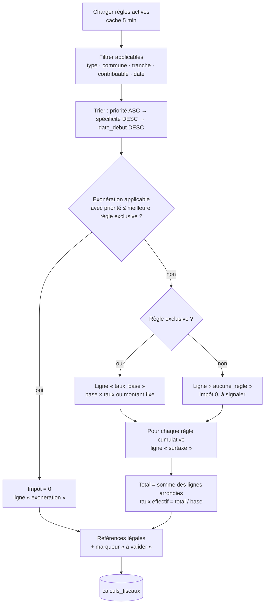

# Moteur fiscal — Module 5

> Calcul configurable de l'impôt sur les revenus locatifs, appelé à chaque
> paiement réussi, rejouable rétroactivement, et auditable ligne par ligne.
> **Le système n'invente jamais de droit fiscal** : chaque règle porte une
> référence légale obligatoire, et les règles non encore validées par la DGI
> sont signalées comme telles jusque dans le PDF.

Voir aussi : [TAX_RULES_REFERENCE.md](./TAX_RULES_REFERENCE.md) (règles actives) ·
[PAYMENT_ARCHITECTURE.md](./PAYMENT_ARCHITECTURE.md) (pipeline aval)

---

## 1. Composants

```
supabase/functions/
├── _shared/tax/
│   ├── rules.ts        # chargement + cache 5 min, applicabilité, spécificité, tri
│   ├── calculator.ts   # evaluateRules (pur) + calculateTax (I/O : règles, calculs_fiscaux)
│   └── legalRef.ts     # références légales, détection « à valider », explications FR
├── tax-calculate/      # Edge Function : calcul autoritaire (paiement) ou simulation (bailleur)
└── tax-recalculate/    # Edge Function admin : recalcul rétroactif + rapport

supabase/migrations/
├── 009_tax_rules_engine.sql   # regles_fiscales v2, calculs_fiscaux, impots étendu, RPC
└── 010_tax_audit.sql          # historique des règles, recalculs, anomalies, RPC dashboards

src/
├── services/tax/taxService.ts # estimation locale + appels moteur + agrégats DGI + prévision
├── hooks/useTaxes.ts · useTaxCompliance.ts
├── pages/bailleur/taxes/      # DashboardPage, DetailPage, SimulatorPage
└── pages/fiscal/              # DashboardPage, AnomaliesPage, ForecastPage
```

---

## 2. Modèle de règle (`regles_fiscales`)

| Colonne | Rôle |
|---|---|
| `nom`, `description` | Libellé et explication affichés au bailleur |
| `type_logement text[]` | Types concernés (`Appartement`, `Studio`, `Villa`, `Bureau`, `Magasin`, `Entrepôt`). `NULL` = tous |
| `commune text[]` | Communes concernées. `NULL` = toutes |
| `tranche_min`, `tranche_max` | Bornes (incluses) sur le loyer brut mensuel |
| `type_contribuable text[]` | `personne_physique`, `personne_morale`. `NULL` = tous |
| `taux numeric` | **Fraction** : `0.10` = 10 % (cohérent avec `impots.taux` du Module 2) |
| `type_taux` | `pourcentage` (taux × base) ou `fixe` (`montant_fixe`) |
| `mode_application` | `exclusif` (une seule règle de base s'applique) ou `cumulatif` (surtaxe ajoutée) |
| `exonere`, `motif_exoneration` | Règle d'exonération |
| `date_debut`, `date_fin`, `is_active` | Validité temporelle |
| `priorite` | Plus petit = évalué en premier (exonérations 10, taux de base 100, surtaxes 200+, filet 900) |
| `reference_legale` **NOT NULL**, `article_loi` | Citation légale |
| `version`, `created_by`, `validated_by`, `validated_at` | Gouvernance |

> Écart assumé par rapport à la spécification initiale : `taux` est stocké en fraction et non en pourcentage, pour rester cohérent avec `impots.taux` et le calcul SQL historique `calculate_tax_for_payment`. Le moteur renvoie les deux formes (`tauxEffectif` fraction, `tauxApplique` pourcentage).

---

## 3. Algorithme d'évaluation (`evaluateRules`)



### Applicabilité

Une règle s'applique si **toutes** les conditions renseignées correspondent : `is_active`, `date_debut ≤ date ≤ date_fin`, `typeLogement ∈ type_logement`, `commune ∈ commune`, `typeContribuable ∈ type_contribuable`, `tranche_min ≤ montant ≤ tranche_max`. Un tableau `NULL`/vide signifie « pas de contrainte ».

### Ordre de priorité

1. `priorite` croissante ;
2. à priorité égale, **spécificité** décroissante — `commune` (+4), `type_logement` (+2), tranche (+1), `type_contribuable` (+1) : une règle ciblée sur Gombe bat une règle nationale de même priorité ;
3. à spécificité égale, la `date_debut` la plus récente.

La fonction SQL `regle_fiscale_specificite()` (migration 009) reproduit exactement ce score pour la RPC `regles_fiscales_applicables` utilisée par le simulateur.

### Exonérations

L'exonération la mieux classée l'emporte si sa priorité est **inférieure ou égale** à celle de la meilleure règle exclusive. On peut donc :

- exonérer globalement les micro-loyers (priorité 10) ;
- ou créer une exonération ciblée à priorité 100 qui ne gagnera que si elle est plus spécifique que le taux de base.

Un impôt exonéré est quand même enregistré (`impots.status = 'exonere'`, montant 0) : le paiement reste tracé.

### Cumul

Toute règle `cumulatif` applicable est ajoutée après la règle de base, dans l'ordre de tri, sur la même base imposable. Chaque surtaxe est une ligne distincte du détail, avec sa propre référence légale.

### Arrondis

Chaque ligne est arrondie à 2 décimales ; le total est la somme des lignes arrondies — le détail affiché correspond toujours au centime au montant stocké.

---

## 4. Entrées / sorties

```ts
interface TaxCalculationInput {
  montantBrut: number;        // loyer brut mensuel = base imposable
  typeLogement: string;       // enum property_type
  commune: string;
  typeContribuable: string;   // personne_physique | personne_morale
  dateTransaction: string;    // ISO
  bailleurId: string;
  paiementId?; contratId?; periode?  // contexte persisté
}

interface TaxCalculationOutput {
  baseImposable; montantImpot; tauxEffectif /* 0.10 */; tauxApplique /* 10 */;
  exonere; motifExoneration;
  reglesAppliquees: string[];          // ids des règles qui ont joué
  referenceLegale: string;             // citation consolidée
  references: LegalReference[];        // par règle, avec pendingValidation
  detail: CalculationDetail[];         // lignes ordonnées (type, taux, base, montant, cumul, référence)
  calculationVersion: string;          // TAX_CALCULATION_VERSION
  dateEcheance: string | null;         // 15 du mois suivant la période
  calculId?: string;                   // ligne calculs_fiscaux
}
```

---

## 5. Points d'entrée

### `tax-calculate`

| Appelant | Auth | Comportement |
|---|---|---|
| Pipeline aval (`_shared/pipeline.ts`) | appel en processus (ou `INTERNAL_FUNCTION_SECRET`) | Calcul autoritaire, persistance `calculs_fiscaux(type='paiement')`, création de l'`impots` lié au paiement |
| Bailleur (simulateur) | JWT | `simulation: true` obligatoire ; persistance `calculs_fiscaux(type='simulation')`, jamais d'`impots` |
| Staff | JWT | Calcul libre, persistance optionnelle |

### `tax-recalculate` (admin)

Recalcule les `impots` non encore payés/annulés (filtres : période, bailleur, commune, limite) avec les règles **actuelles**, produit un rapport de deltas et, hors `dryRun`, applique : `impots.montant`, `montant_precedent`, `recalcule_at`, `regles_appliquees`, `reference_legale`, écritures `ledger_entries` d'ajustement. Chaque exécution est journalisée dans `recalculs_fiscaux` (motif, filtres, compteurs, rapport).

### RPC SQL (frontend)

| RPC | Usage |
|---|---|
| `regles_fiscales_applicables(type, commune, montant, contribuable, date)` | Règles qui matchent, triées comme le moteur (simulateur) |
| `get_bailleur_tax_summary(bailleur, préfixe période)` | Totaux calculé / payé / dû / en retard + série par période |
| `get_compliance_breakdown(bailleur)` | Score 0-100 et ses 4 composantes (KYC 25, ponctualité 35, impôts 25, biens 15) |
| `get_fiscal_dashboard(from, to)` | Agrégats DGI : total, période précédente, par commune, par type, top 20, distribution conformité, croissance, anomalies |
| `get_fiscal_monthly_series(months)` | Série mensuelle impôts / loyers / paiements / nouveaux contrats (prévision) |
| `detect_fiscal_anomalies()` | Détection (staff) — voir § 8 |
| `mark_overdue_taxes()` | Cron : `calcule/declare` échus → `en_retard` |

---

## 6. Ajouter ou modifier une règle — sans code

1. **Rédiger** la règle avec la DGI : périmètre (types, communes, tranche, contribuable), taux ou montant fixe, mode (`exclusif`/`cumulatif`), priorité, dates, **référence légale et article**.
2. **Insérer** (Dashboard Supabase ou SQL) :

```sql
INSERT INTO public.regles_fiscales
  (nom, description, type_logement, commune, tranche_min, taux, type_taux, mode_application,
   date_debut, priorite, reference_legale, article_loi, is_active)
VALUES
  ('Surtaxe communale — Limete', 'Taxe additionnelle communale de 0,5 %',
   NULL, ARRAY['Limete'], 50000, 0.005, 'pourcentage', 'cumulatif',
   '2026-10-01', 200, 'Arrêté communal n° … du …', 'Art. 3', true);
```

3. **Vérifier** dans le simulateur bailleur (`/bailleur/fiscalite/simulateur`) : la règle apparaît dans « Règles appliquées » avec sa référence. Le cache des Edge Functions expire en 5 minutes maximum.
4. **Recalculer** si la règle est rétroactive : `tax-recalculate` en `dryRun: true`, lecture du rapport, puis application.
5. **Documenter** dans [TAX_RULES_REFERENCE.md](./TAX_RULES_REFERENCE.md) (journal des modifications).

Pour **retirer** une règle : `is_active = false` ou `date_fin`. Ne jamais supprimer : l'historique des calculs référence son `id`.

Pour **changer un taux** : préférer clôturer la règle (`date_fin`) et en créer une nouvelle (`date_debut`) — les calculs passés restent explicables avec la règle en vigueur à leur date.

---

## 7. Piste d'audit

| Table | Contenu |
|---|---|
| `calculs_fiscaux` | Chaque calcul (paiement, simulation, recalcul) : entrée, règles appliquées, base, montant, `detail_calcul` JSONB, référence légale, version d'algorithme |
| `impots` | Obligation par paiement, liée à `calcul_fiscal_id`, avec `base_imposable`, `commune`, `type_logement`, `reference_legale`, `detail_calcul`, `date_echeance`, `regles_appliquees`, `recalcule_at`, `montant_precedent` |
| `regles_fiscales_historique` | Trigger `trg_regles_fiscales_history` : ancienne et nouvelle version de chaque règle modifiée/supprimée, auteur |
| `recalculs_fiscaux` | Chaque exécution de `tax-recalculate` : motif, filtres, dry-run, compteurs, rapport |
| `ledger_entries` | Écritures DGI (débit impôt), ajustements de recalcul, contre-passations de remboursement |
| `audit_logs` | Actions (`tax.calculated`, `tax.recalculated`, `payment.refunded`…) |

RLS : le bailleur ne voit que ses `impots`/`calculs_fiscaux` ; `agent_fiscal` et `admin` voient tout ; l'écriture est réservée au rôle service.

---

## 8. Conformité et intelligence fiscale

### Score de conformité (0-100)

Recalculé par `check_compliance_score()` à chaque paiement réussi (étape `compliance` du pipeline) et lisible via `get_compliance_breakdown` :

| Composante | Max | Source |
|---|---|---|
| KYC | 25 | `users.kyc_status` (verified 25, submitted 15, pending 5) |
| Ponctualité des loyers | 35 | Part des paiements `succeeded` reçus avant le 15 du mois suivant la période |
| Impôts déclarés / payés | 25 | Part des `impots` en statut `paye`/`declare` (12,5 par défaut sans historique) |
| Biens enregistrés | 15 | Au moins un logement |

Niveaux : `excellent` ≥ 90, `good` ≥ 75, `warning` ≥ 50, `critical` < 50.

### Anomalies (`detect_fiscal_anomalies`)

| Type | Signal |
|---|---|
| `loyer_sous_evalue` | Loyer < 50 % de la médiane commune × type (échantillon ≥ 3) ; `high` sous 30 % |
| `occupe_sans_contrat` | Logement `occupe` sans contrat actif |
| `portefeuille_faible_revenu` | ≥ 3 biens et moins d'un paiement réussi par bien sur 6 mois |
| `paiement_sans_contrat_actif` | Paiement réussi sur un contrat non actif |
| `doublon_logement` | Même adresse / commune / parcelle enregistrée plusieurs fois |
| `changements_compte_frequents` | ≥ 3 changements de compte de règlement en 90 jours (`audit_logs`) |
| `refund_after_tax_paid` | Remboursement d'un paiement dont l'impôt était déjà reversé (émis par `payment-refund`) |

Chaque anomalie porte sévérité, entités liées, `signaux` JSONB, action suggérée, et un cycle `detected → reviewed | escalated | dismissed` géré depuis `/fiscal/anomalies`. L'`empreinte` évite les doublons entre deux détections.

### Prévisions

`taxService.getForecast()` (modèle **explicable**, pas de boîte noire) : régression linéaire sur 12 mois (70 %) + niveau moyen (30 %), pondération par le taux de conformité, scénarios optimiste/pessimiste à écart croissant, bande de confiance ±1,28 σ des résidus (≈ 80 %). Fonction pure `buildForecast` testée unitairement.

---

## 9. Frontend

- **Estimation locale** (`estimateBreakdown`) : affichée dans le wizard de paiement **avant** confirmation, clairement marquée `estimated: true`. Elle n'écrit jamais rien.
- **Calcul autoritaire** : uniquement par le moteur ; le frontend lit `impots` / `calculs_fiscaux`.
- **Tableau de bord bailleur** (`/bailleur/fiscalite`) : jauge de conformité, obligations par période, échéances, historique, attestation PDF, panneau « Comprendre mes impôts ».
- **Simulateur** (`/bailleur/fiscalite/simulateur`) : scénarios ±10 % / ±25 %, détail des règles, références légales, export PDF. Chaque simulation est persistée (`type='simulation'`).
- **DGI** : `/fiscal/tableau-de-bord`, `/fiscal/anomalies`, `/fiscal/previsions`.
- Rafraîchissement live via Realtime sur `impots` et `bailleurs`.
